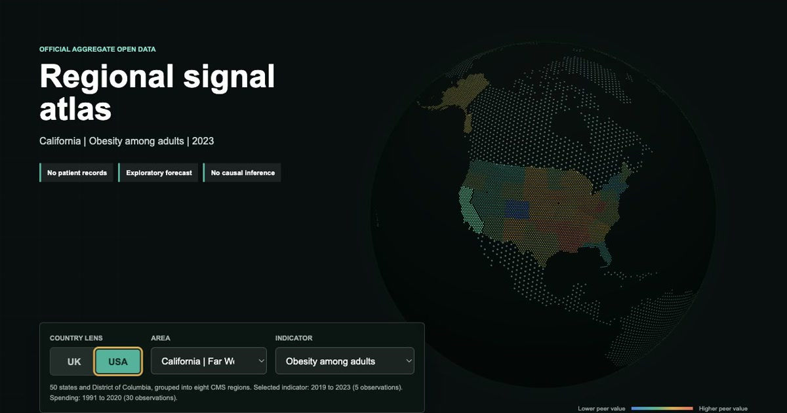
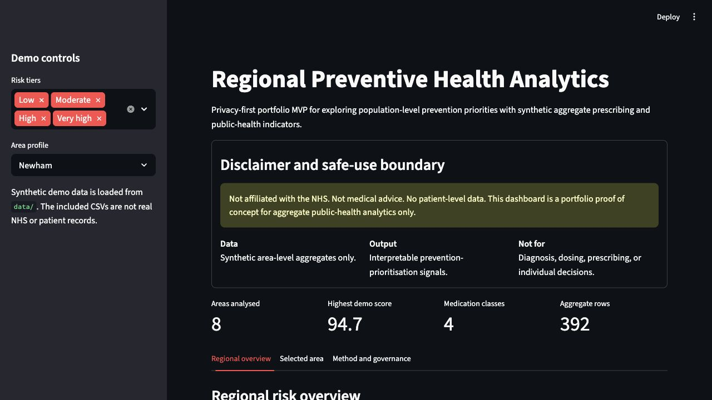
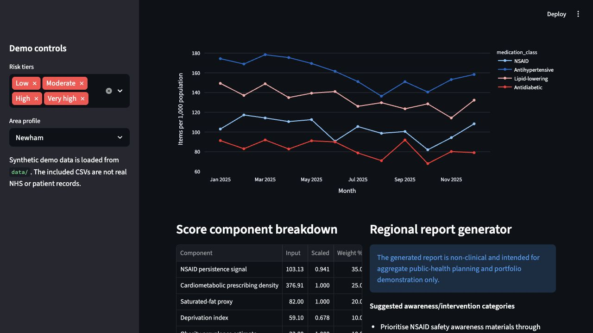

# Regional Preventive Health Analytics

[](https://github.com/Pharmacist65/regional-health-risk-ai/actions/workflows/tests.yml)

A privacy-first public-health analytics portfolio project with two review paths:
an official aggregate UK/USA regional evidence explorer and a synthetic
Streamlit prevention-planning MVP.

> Not affiliated with the NHS, CDC, CMS or any government agency. Not medical
> advice. No patient-level data. Forecasts are exploratory and contribution
> hypotheses are not causal findings.

[Open the live UK/USA regional explorer](https://pharmacist65.github.io/regional-health-risk-ai/)
| [Watch the 28-second walkthrough](https://pharmacist65.github.io/regional-health-risk-ai/media/regional-health-atlas-demo.mp4)

[](https://pharmacist65.github.io/regional-health-risk-ai/)

## Regional evidence explorer

The static GitHub Pages explorer is a **research preview**. It provides:

- separate England and United States analytical views
- nine English statistical regions and all 50 US states plus District of Columbia
- official historical prevalence indicators with source definitions
- nominal health-spending history in the source currency
- same-country peer distributions and selected-area trajectories
- transparent two-period recent-trend forecasts with diagnostics and an 80% exploratory band
- evidence-linked contribution hypotheses framed as questions for further research
- an interactive dotted WebGL globe with country, US state and England-region
  boundary hit testing plus a local dotted-canvas fallback

Run it from the repository root:

```bash
python -m http.server 8765 --directory docs
```

Then open [http://127.0.0.1:8765/](http://127.0.0.1:8765/). A web server is
required because the page loads its versioned JSON data bundle with `fetch()`.

The static app is published from the `docs/` directory at:

`https://pharmacist65.github.io/regional-health-risk-ai/`

## Data coverage

| View | Health history | Spending history | Geography |
| --- | --- | --- | --- |
| England | OHID/NHS England QOF registered prevalence, indicator-dependent 2012/13-2024/25 | HM Treasury identifiable health expenditure per head, 2020/21-2024/25 | Nine statistical regions |
| United States | CDC CDI age-adjusted adult prevalence, indicator-dependent 2019-2023 | CMS all-payer personal health care expenditure per capita, 1991-2020 | 50 states and District of Columbia |

Publisher freshness and full comparable history were rechecked on 2026-08-12.
The explorer uses every available observation for each selected current
indicator definition. It does not splice retired definitions or revised rolling
releases into one apparently continuous series.

The England and US health measures differ in denominator and method. Rankings
are therefore limited to the selected country and measure. Spending definitions,
currencies and periods also differ and are never ranked across countries.

The compact source snapshot, field definitions and rebuild command are in
[data/official/README.md](data/official/README.md). Research decisions and
comparability limits are in [docs/research_sources.md](docs/research_sources.md).

## Forecasting position

`src/regional_forecasting.py` fits ordinary least squares to at most the six most
recent observations and projects two periods. Every result preserves its
training window, slope, R-squared, rolling-origin MAE/sMAPE and bounded
residual-variation interval. Series with fewer than four observations are not
forecast.

This is an auditable portfolio baseline, not a clinical or budget prediction.
See [docs/forecasting_methodology.md](docs/forecasting_methodology.md).

## Contribution hypotheses

`src/regional_hypotheses.py` maps selected indicators to evidence-linked
investigation prompts such as age structure, detection, smoking history,
occupational exposure, obesity, activity, deprivation, screening and access.
The interface explicitly avoids claiming that any prompt explains an observed
regional pattern.

## Streamlit demo

[Open the existing Streamlit dashboard](https://regional-health-risk-ai-ikqhu3ynfpabw2emgxg6br.streamlit.app/)

The Streamlit path remains a reproducible synthetic-data product demonstration:
aggregate prescribing analytics, transparent prevention-prioritisation scoring,
map exploration and selected-area report export. The values are synthetic and
must not be interpreted as evidence about named places.





## Architecture

```text
Official downloaded tables                     Synthetic demo CSVs
OHID / ONS / HMT / CDC / CMS                   prescribing / context
              |                                      |
              v                                      v
 scripts/build_regional_dataset.py          connectors + validation
              |                                      |
              v                                      v
 compact regional CSV + JSON                  transparent score
              |                                      |
              v                                      v
 static HTML evidence explorer                Streamlit dashboard
```

The official-data builder reads local source downloads, makes no live API calls,
requires no credentials and writes only aggregate outputs. The Streamlit runtime
continues to use synthetic CSVs by default.

## Repository structure

```text
app/
  streamlit_app.py                 # synthetic-data interactive MVP
data/
  official/                        # compact official aggregate outputs + provenance
docs/
  index.html                       # static UK/USA evidence explorer
  assets/                          # dashboard CSS, JS and generated JSON
scripts/
  build_regional_dataset.py        # offline official-source transform
  build_globe_geography.py         # public display-boundary transform
src/
  connectors.py                    # synthetic/open-data connector boundary
  open_data_mapping.py             # local aggregate schema mapping helpers
  regional_forecasting.py          # auditable short-horizon OLS baseline
  regional_hypotheses.py           # evidence-linked research prompts
  risk_model.py                    # synthetic MVP feature and score layer
  validation.py                    # aggregate input validation
tests/                              # model, mapping, governance and data checks
```

## Development

```bash
python -m venv .venv
source .venv/bin/activate  # Windows: .venv\Scripts\activate
pip install -r requirements.txt
pytest
```

Run the Streamlit MVP:

```bash
streamlit run app/streamlit_app.py
```

Run the static explorer:

```bash
python -m http.server 8765 --directory docs
```

## Documentation

- [Architecture](docs/architecture.md)
- [Data governance](docs/data_governance.md)
- [Research sources and comparability](docs/research_sources.md)
- [Forecasting methodology](docs/forecasting_methodology.md)
- [Model card](docs/model_card.md)
- [Scoring methodology](docs/scoring_methodology.md)
- [Ethics and privacy](docs/ethics_privacy.md)
- [Bias review template](docs/bias_review_template.md)
- [Case study](docs/case_study.md)
- [Deployment](docs/deployment.md)
- [Changelog](CHANGELOG.md)

## Ethical boundaries

The project may support portfolio review and exploratory population-health
planning research. It must not be used for diagnosis, triage, treatment advice,
prescribing decisions, individual risk prediction or automated resource
allocation. Regional values can reflect age, detection, coding, denominator,
survey and service differences as well as underlying health patterns.

## Roadmap

- [x] Offline aggregate OpenPrescribing/OHID mapping helpers
- [x] Official England and US regional source snapshot
- [x] Historical health and spending views
- [x] Transparent short-horizon forecast with rolling diagnostics
- [x] Evidence-linked, non-causal investigation prompts
- [x] Static GitHub Pages-compatible explorer
- [ ] Add Scotland, Wales and Northern Ireland only through definition-preserving views
- [ ] Add inflation-adjusted spending alongside nominal values
- [ ] Compare OLS with naive, drift and hierarchical baselines
- [x] Publish the static explorer after visual and governance review
